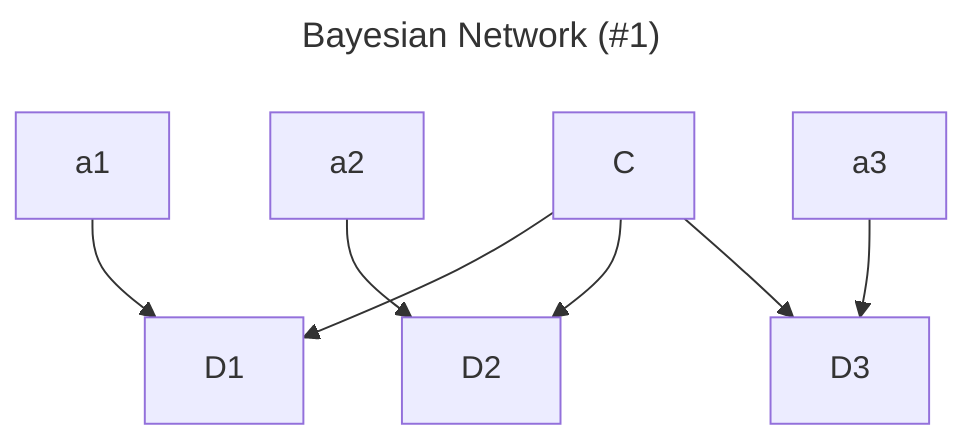
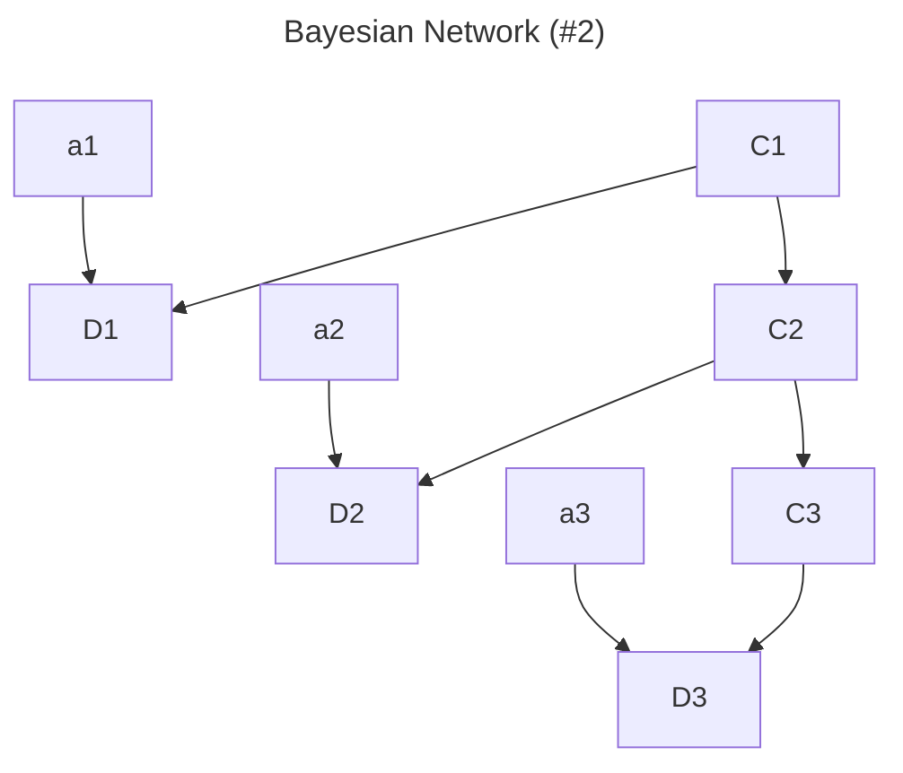

# Homework 3

%% [Reference 1](https://github.com/rohitapte/cs221/blob/master/car) %%
%% [Reference 2](https://github.com/erickmiller/AutomatousSourceCode/) %%
%% Cloned on vlab-main %%

## 问题 1：概率推断

### a



### b

$$
\begin{aligned}
&P(C=c, D_1=d_1, D_2=d_2, D_3=d_3)\\
=&P(D_1=d_1, D_2=d_2, D_3=d_3|C=c)P(C=c)\\
=&P(C=c)\prod_{i=1}^3P(D_i=d_i|C=c)
\end{aligned}
$$

### c

$$
\begin{aligned}
&P(C=c|D_1=d_1\dots,D_t=d_t)\\
=&P(C=c)P(D_1=d_1\dots,D_t=d_t|C=c)/P(D_1=d_1\dots,D_t=d_t)\\
=&\frac{P(C=c)P(D_1=d_1\dots,D_{t-1}=d_{t-1}|C=c)P(D_t=d_t|C=c)}{P(D_1=d_1\dots,D_{t-1}=d_{t-1})P(D_t=d_t)}\\
=&\frac{P(D_t=d_t|C=c)}{P(D_t=d_t)}\cdot\frac{P(C=c,D_1=d_1\dots,D_{t-1}=d_{t-1})}{P(D_1=d_1\dots,D_{t-1}=d_{t-1})}\\
=&\frac{P(D_t=d_t|C=c)}{P(D_t=d_t)}\cdot P(C=c|D_1=d_1\dots,D_{t-1}=d_{t-1})\\
\propto& P(D_t=d_t|C=c)P(C=c|D_1=d_1\dots,D_{t-1}=d_{t-1})
\end{aligned}
$$

### d

```python
def observe(self, agentX: int, agentY: int, observedDist: float) -> None:
    # BEGIN_YOUR_CODE (our solution is 7 lines of code, but don't worry if you deviate from this)
    for row in range(self.belief.getNumRows()):
        for col in range(self.belief.getNumCols()):
            x, y = util.colToX(col), util.rowToY(row)
            distance = math.dist((x, y), (agentX, agentY))
            density = util.pdf(distance, Const.SONAR_STD, observedDist)
            previousProb = self.belief.getProb(row, col)
            self.belief.setProb(row, col, previousProb * density)
    self.belief.normalize()
    # END_YOUR_CODE
```

## 问题 2：转移概率

### a



### b

$$
\begin{aligned}
&P(C_1=c_1, C_2=c_2, C_3=c_3, D_1=d_1, D_2=d_2, D_3=d_3)\\
=&P(D_1=d_1, D_2=d_2, D_3=d_3|C_1=c_1, C_2=c_2, C_3=c_3)\\
&\cdot P(C_1=c_1, C_2=c_2, C_3=c_3)\\
=&P(C_1=c_1)P(C_2=c_2|C_1=c_1)P(C_3=c_3| C_2=c_2)\\
\cdot&\prod_{i=1}^3P(D_i=d_i|C_1=c_1, C_2=c_2, C_3=c_3)
\end{aligned}
$$

### c

$$
\begin{aligned}
&P(C_{t+1}=c_{t+1}|D_1=d_1\dots,D_t=d_t)\\
=&P(C_{t+1}=c_{t+1},D_1=d_1\dots,D_t=d_t)/P(D_1=d_1\dots,D_t=d_t)\\
=&\frac{\sum_{c_t}P(C_t=c_t,D_1=d_1\dots,D_t=d_t)p(c_{t+1}|c_t)}{P(D_1=d_1\dots,D_t=d_t)}\\
=&\sum_{c_t}P(C_t=c_t|D_1=d_1\dots,D_t=d_t)p(c_{t+1}|c_t)
\end{aligned}
$$

### d

```python

```

## 3


## 4


## 5


