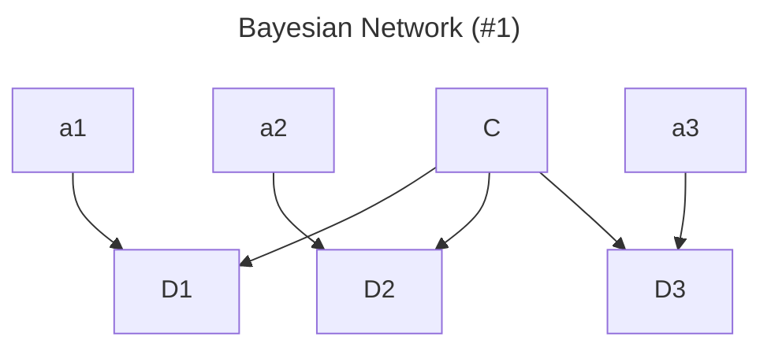
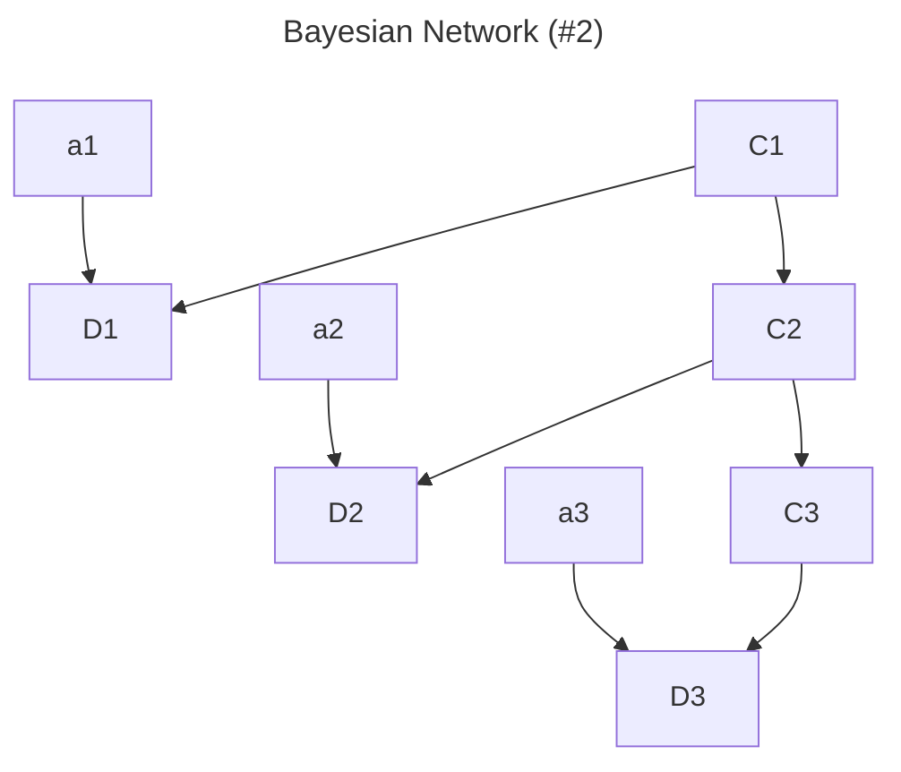

# Homework 3

%% [Reference 1](https://github.com/rohitapte/cs221/blob/master/car) %%
%% [Reference 2](https://github.com/erickmiller/AutomatousSourceCode/) %%

%% ## 题干
我们假设世界是一个二维矩形网格，你的车和其他 K 辆车就在这个网格上。在每一个时间步长 $t$，你的车会得到对每辆其他车距离的带有噪声的估计。为了简化假设，我们认为其他 $K$ 辆车是独立
移动的，对每辆车距离估计中的噪声也是独立的。因此，在下文中，我们将首先独立地对每辆其他车进行推理。在下面的符号中，我们将假设只有一辆其他车，然后再进行推广。在每一个时间步长 $t$，设 $C_t\in\mathbb{R}^2$ 是一对坐标，代表单个其他车辆的实际位置（未被观察到）。我们假设有一个局部条件分布 $p(c_t|c_{t−1})$ 来控制其他车辆的移动。设 $a_t\in\mathbb{R}^2$ 是你的车的位置，你可以观察并控制它。

为了降低成本，我们使用了一个基于声波的简单感应系统。该系统为我们提供了 $D_t$ ，它是一个高斯随机变量，其均值等于你的车与另一辆车之间的真实距离，方差为 $\sigma^2$。用数学符号表示为：$D_t\sim\mathcal{N}(\|a_t-C_t\|_2,\sigma^2)$。例如，如果你的车位于 $a_t=(1, 3)$ 而另一辆车位于 $C_t=(4, 7)$，那么实际距离是 $5$，而 $D_t$ 可能是 $4.6$ 或 $5.2$ 等。

你的任务是实现一个汽车追踪器，它（大致）计算后验分布 $P(C_t|D_1=d_1\dots,D_t=d_t)$（你对其 他车辆位置的信念），并且对每个 $t=1, 2,\dots$ 进行更新。为了简化问题，我们将世界离散化为由 $(row, col)$ 对表示的网格中，其中 $0\leq row<numRows$ 且 $0\leq col<numCols$ 。对于每个网格，我们存储一个代表我们相信该网格上有一辆车的概率。
%%

## 问题 1：概率推断

%%
在这个问题中，我们假设另外只有一辆车，并且它是静止的（$\forall t, C_t=C_{t-1}=C$）。我们将表示另一辆车静止位置的单一变量记为 $C$，并注意 $p(C)$ 是一个已知的局部条件 分布。当你在观察到新的距离测量 $D_t = d_t$ 时，应从当前的后验概率 $P(C=c|D_1=d_1\dots,D_{t-1}=d_{t-1})$ 更新下一个时间步的后验概率 $P(C=c|D_1=d_1\dots,D_t=d_t)$。

### 小问 a
画一个贝叶斯网络来描述变量 $C, D_1, D_2, D_3, a_1, a_2, a_3$ 的分布。无需考虑时间步长 $t = 3$ 之后的变量。如果 $p(X|Parents(X))$ 是一个已知的局部条件分布，那么应该有一个箭头从 $X$ 的每个父节点指向 $X$。

### 小问 b
给出联合概率 $P(C=c, D_1=d_1, D_2=d_2, D_3=d_3)$ 的表达式。你的表达式应该只使用贝叶斯网络给出的已知局部条件分布。(你的车在每个时间步的位置 $a_1, a_2, a_3$，是确定已知的)

### 小问 c
现在假设我们已经计算了直到时间步长 $t-1$ 的后验分布，即我们知道 $P(C|D_1=d_1\dots,D_{t-1}=d_{t-1})$。我们进行了一个新的观察 $D_t=d_t$，希望将后验分布更新为 $P(C=c, D_1=d_1, D_2=d_2, D_3=d_3)$。试证明：
$$
P(C=c|D_1=d_1\dots,D_t=d_t)\propto P(C=c|D_1=d_1\dots,D_{t-1}=d_{t-1})p(d_t|C=c)
$$
%%

### a



### b

$$
\begin{aligned}
&P(C=c, D_1=d_1, D_2=d_2, D_3=d_3)\\
=&P(D_1=d_1, D_2=d_2, D_3=d_3|C=c)P(C=c)\\
=&P(C=c)\prod_{t=1}^3P(D_t=d_t|C=c)
\end{aligned}
$$

### c
$$P(C=c|D_1=d_1,\dots,D_t=d_t) = \frac{P(C=c, D_1=d_1,\dots,D_t=d_t)}{P(D_1=d_1,\dots,D_t=d_t)}.$$
考虑 $P(C=c, D_1=d_1,\dots,D_t=d_t)$：
$$
\begin{aligned}
&P(C=c, D_1=d_1,\dots,D_t=d_t)\\
=&P(D_t=d_t|C=c, D_1=d_1,\dots,D_{t-1}=d_{t-1}) P(C=c, D_1=d_1,\dots,D_{t-1}=d_{t-1})\\
=&P(D_t=d_t|C=c) P(C=c, D_1=d_1,\dots,D_{t-1}=d_{t-1})
\end{aligned}
$$
其中 $P(C=c, D_1=d_1,\dots,D_{t-1}=d_{t-1})$ 可以表示为：
$$P(C=c|D_1=d_1,\dots,D_{t-1}=d_{t-1}) P(D_1=d_1,\dots,D_{t-1}=d_{t-1})$$
因此原式可以表示为：
$$
\frac{P(D_t=d_t|C=c) P(C=c|D_1=d_1,\dots,D_{t-1}=d_{t-1}) P(D_1=d_1,\dots,D_{t-1}=d_{t-1})}{P(D_1=d_1,\dots,D_t=d_t)}
$$
注意 $P(D_1=d_1,\dots,D_{t-1}=d_{t-1})$ 以及 $P(D_1=d_1,\dots,D_t=d_t)$ 是常数，与 $C=c$ 无关，所以：
$$P(C=c|D_1=d_1,\dots,D_t=d_t) \propto P(D_t=d_t|C=c) P(C=c|D_1=d_1,\dots,D_{t-1}=d_{t-1}).$$
也就是说：
$$P(C=c|D_1=d_1,\dots,D_t=d_t) \propto P(C=c|D_1=d_1,\dots,D_{t-1}=d_{t-1}) p(d_t|C=c).$$

### d

```python
def observe(self, agentX: int, agentY: int, observedDist: float) -> None:
    # BEGIN_YOUR_CODE (our solution is 7 lines of code, but don't worry if you deviate from this)
    for row in range(self.belief.getNumRows()):
        for col in range(self.belief.getNumCols()):
            x, y = util.colToX(col), util.rowToY(row)
            distance = math.dist((x, y), (agentX, agentY))
            density = util.pdf(distance, Const.SONAR_STD, observedDist)
            previousProb = self.belief.getProb(row, col)
            self.belief.setProb(row, col, previousProb * density)
    self.belief.normalize()
    # END_YOUR_CODE
```

## 问题 2：转移概率

%%
现在，让我们考虑另一辆车根据转移概率 $p(C_{t+1}|C_t)$ 移动的情况。具体来说，$p(C_{t+1}|C_t)$ 是已知另一辆车时间 $t$ 在 $C_t$ 的前提下，时间 $t+1$ 在 $C_{t+1}$ 的概率。

### 小问 a
画一个贝叶斯网络来描述变量 $C_1, C_2, C_3, D_1, D_2, D_3, a_1, a_2, a_3$ 的分布。无需考虑时间步长 $t = 3$ 之后的变量。如果 $p(X|Parents(X))$ 是一个已知的局部条件分布，那么应该有一个箭头从 $X$ 的每个父节点指向 $X$。

### 小问 b
给出联合概率 $P(C_1=c_1, C_2=c_2, C_3=c_3, D_1=d_1, D_2=d_2, D_3=d_3)$ 的表达式。你的表达式应该只使用贝叶斯网络给出的已知局部条件分布。(你的车在每个时间步的位置 $a_1, a_2, a_3$ 是确定已知的)

### 小问 c
现在假设我们已经得到了直到时间 $t$ 的车辆位置的条件概率 $P(C_t=c_t|D_1=d_1\dots,D_t=d_t)$，我们已知另一辆车根据转移概率 $p(C_{t+1}|C_t)$ 移动。在时间步 $t+1$，我们希望计算条件概率 $P(C_{t+1}=c_{t+1}|D_1=d_1\dots,D_t=d_t)$。证明下面的公式的正确性：
$$
P(C_{t+1}=c_{t+1}|D_1=d_1\dots,D_t=d_t)\propto\sum_{c_t}P(C_t=c_t|D_1=d_1\dots,D_t=d_t)p(c_{t+1}|c_t)
$$
%%

### a



### b

$$
\begin{aligned}
&P(C_1=c_1, C_2=c_2, C_3=c_3, D_1=d_1, D_2=d_2, D_3=d_3)\\
=&P(D_1=d_1, D_2=d_2, D_3=d_3|C_1=c_1, C_2=c_2, C_3=c_3)\\
&\cdot P(C_1=c_1, C_2=c_2, C_3=c_3)\\
=&P(C_1=c_1)P(C_2=c_2|C_1=c_1)P(C_3=c_3| C_2=c_2)\\
\cdot&\prod_{t=1}^3P(D_t=d_t|C_1=c_1, C_2=c_2, C_3=c_3)\\
=&P(C_1=c_1)P(C_2=c_2|C_1=c_1)P(C_3=c_3| C_2=c_2)\cdot\prod_{t=1}^3P(D_t=d_t|C_t=c_t)
\end{aligned}
$$

### c

$$
\begin{aligned}
&P(C_{t+1}=c_{t+1}|D_1=d_1\dots,D_t=d_t)\\
=&P(C_{t+1}=c_{t+1},D_1=d_1\dots,D_t=d_t)/P(D_1=d_1\dots,D_t=d_t)\\
=&\frac{\sum_{c_t}P(C_t=c_t,D_1=d_1\dots,D_t=d_t)P(C_{t+1}=c_{t+1}|C_t=c_t)}{P(D_1=d_1\dots,D_t=d_t)}\\
=&\sum_{c_t}P(C_t=c_t|D_1=d_1\dots,D_t=d_t)p(c_{t+1}|c_t)
\end{aligned}
$$

### d

```python
def elapseTime(self) -> None:
    if self.skipElapse:  ### ONLY FOR THE GRADER TO USE IN Problem 1
        return
    # BEGIN_YOUR_CODE (our solution is 7 lines of code, but don't worry if you deviate from this)
    belief = util.Belief(self.belief.getNumRows(), self.belief.getNumCols(), 0)
    for oldTile, newTile in self.transProb:
        # Transition probability from oldTile to newTile
        prob = self.transProb[(oldTile, newTile)]
        if prob > 0:
            # Previous probability of oldTile
            prevProb = self.belief.getProb(*oldTile)
            belief.addProb(*newTile, prevProb * prob)
    self.belief = belief
    self.belief.normalize()
    # END_YOUR_CODE
```

## 问题 3：是哪辆车？

%%
到目前为止，我们假设每辆车在每个时间步都有一个独特的噪声距离读数。实际上，我们的声波测距系统只会捕捉到这些信号的一个不加区分的集合，我们不知道哪个距离读数对应哪辆车。现在，我们将考虑这种更现实的情况。
首先，让我们扩展之前的符号：设 $C_{ti}\in\mathbb{R}^2$ 为第 $i$ 辆车在时间 $t$ 的位置，其中 $i=1, \dots, K$ ，$t=1, \dots, T$。回想一下，所有的车辆都根据之前的转移概率独立移动。设 $D_{ti}\in\mathbb{R}$ 为第 $i$ 辆车在时间步 $t$ 的噪声距离测量值，这不再是直接观察到的。相反，我们观察到的是作为一个整体的无序距离集合 $\{D_{t1},\dots,D_{tK}\}$，因此不能将这个集合中的任何测量值确定给特定的车辆。（为了简单起见，我们假设所有距离都是不同的值。）换句话说，你可以将这种情况想象为观察列表 $E_t=[E_{t1},\dots,E_{tK}]$，它是噪声距离测量值 $D_t=[D_{t1},\dots,D_{tK}]$ 的一个均匀随机排列，其中索引 $i$ 表示时间 $t$ 对车 $i$ 的噪声距离。
例如，假设 $K=2$ 和 $T=2$。之前，我们可能在时间步 $1$ 和 $2$ 分别得到了第一辆车的距离读数 $8$ 和 $4$，以及第二辆车的距离读数 $5$ 和 $7$。现在，我们的传感器读数将是 $8,5$（在时间步 $1$）和 $4,7$（在 时间步 $2$）的排列。因此，即使我们知道第二辆车在时间 $t=1$ 时距离为 $5$，我们也不知道它在时间 $t=2$ 是移动得更远（到距离 $7$）还是更近（到距离 $4$）。
下面是一个图，显示了上述情况对应的信息流，其中 $K=2$ 并且只显示两个时间步 $t$ 和 $t+1$。请注意，由于观察到的距离 $E_t$ 是真实距离 $D_t$ 的排列，每个 $E_{ti}$ 依赖于所有的 $D_{ti}$。另请注意，下图不是一个贝叶斯网络，因为 $E_{t1}$ 和 $E_{t2}$ 在给定 $D_{t1}$ 和 $D_{t2}$ 的情况下并不是条件独立的（然而，$D_{t1}$ 和 $D_{t2}$ 在给定 $C_{t1}$ 和 $C_{t2}$ 的情况下是条件独立的）。


### 小问 a
假设我们有 $K=2$ 辆车和一个时间步长 $T=1$。写出条件概率 $p(C_{11}=c_{11}, C_{12}=c_{12}|E_1=e_1)$ 关于高斯概率密度函数 $p_N(\upsilon;\mu,\sigma^2)$ 和先验概率 $p(c_{11})$ 与 $p(c_{12})$ 的函数表达式。注意，对于条件 $E_1=e_1$，我们说我们已经得到了一组观测值，但不知道哪个距离与哪辆车相关。你的最终答案不应包含变量 $D_{11}, D_{12}$。($p_N(\upsilon;\mu,\sigma^2)$ 是随机变量 $\upsilon$ 在均值为 $\mu$ 和标准差为 $\sigma$ 的高斯分布中的概率。)
提示：对于 $K=1$，答案将是 $p(C_{11}=c_{11}|E_1=e_1)\propto p(c_{11})p_N(e_{11};\|a_1-c_{11}\|_2,\sigma^2)$。

### 小问 b
假设现在你更换了传感器，使得在每个时间步 $t$，它们返回 $K$ 辆车的确切位置列表，但位置列表会随机移动若干个索引（并且可以环绕）。例如，如果在时间步 $1$ 真实的车辆位置是 $c_{11}=(1, 1), c_{12}=(3, 1), c_{13}=(8, 1), c_{14}=(5, 2)$，那么 $e_1$ 可能是 $[(1, 1),(3, 1),(8, 1),(5, 2)]$、$[(3, 1),(8, 1),(5, 2),(1, 1)]$、$[(8, 1),(5, 2),(1, 1),(3, 1)]$ 或 $[(5, 2),(1, 1),(3, 1),(8, 1)]$，每个都有 $1/4$ 的概率。这个移动可以从一个时间步到下一个时间步改变。
请定义辅助变量 $z_1, z_2, \dots, z_t$，它们可以用来模拟 $c_t$ 和 $e_t$ 之间的关系。要求说明辅助变量 $z_t$ 的描述及域，并给出 $p(c_t| c_{t−1})$ 关于 $e_1, \dots, e_t$ 和 $z_t$ 的表达式。

### 小问 c
继小问 b 之后，请描述一个有效的算法来计算任何时间步长 $t$ 和车辆 $i$ 的 $p(c_{ti}|e_1, \dots, e_T)$。你的算法不应该是关于 $K$ 或 $T$ 的指数级别的。你需要描述：建模问题时使用的因子图/贝叶斯网络，包括任何相关变量和条件概率；以及如何使用因子图来计算所提供的概率。请注意，你应尽可能简化所提供信息的概率表达式。
%%

### a

在这个问题中，我们需要找到在 $K=2$ 辆车和一个时间步长 $T=1$ 的情况下，条件概率 $p(C_{11}=c_{11}, C_{12}=c_{12}|E_1=e_1)$。我们已知我们有两个观测距离 $E_{11}$ 和 $E_{12}$，但不知道哪个距离与哪辆车相关。

首先，我们记住，观测到的距离 $E_{11}$ 和 $E_{12}$ 是实际距离 $D_{11}$ 和 $D_{12}$ 的随机排列。因此，我们需要考虑两种可能的排列情况：
1. $E_{11}$ 对应 $D_{11}$，$E_{12}$ 对应 $D_{12}$。
2. $E_{11}$ 对应 $D_{12}$，$E_{12}$ 对应 $D_{11}$。

因此，条件概率可以写成这两种情况的总和：

$$
p(C_{11}=c_{11}, C_{12}=c_{12}|E_1=e_1) \propto p(c_{11}) p(c_{12}) \left[p_N(e_{11}; \|a_1 - c_{11}\|_2, \sigma^2) p_N(e_{12}; \|a_1 - c_{12}\|_2, \sigma^2) + p_N(e_{11}; \|a_1 - c_{12}\|_2, \sigma^2) p_N(e_{12}; \|a_1 - c_{11}\|_2, \sigma^2) \right].
$$

在这个表达式中：
- $p(c_{11})$ 和 $p(c_{12})$ 是先验概率。
- $p_N(\upsilon; \mu, \sigma^2)$ 是均值为 $\mu$ 和方差为 $\sigma^2$ 的高斯概率密度函数。
- $\|a_1 - c_{11}\|_2$ 和 $\|a_1 - c_{12}\|_2$ 是你的车位置 $a_1$ 到车 $C_{11}$ 和车 $C_{12}$ 位置的欧几里得距离。

因此，考虑到上述两种可能的排列情况，条件概率 $p(C_{11}=c_{11}, C_{12}=c_{12}|E_1=e_1)$ 的最终表达式是：

$$
\begin{aligned}
&p(C_{11}=c_{11}, C_{12}=c_{12}|E_1=e_1)\\
\propto &p(c_{11}) p(c_{12}) [p_N(e_{11}; \|a_1 - c_{11}\|_2, \sigma^2) p_N(e_{12}; \|a_1 - c_{12}\|_2, \sigma^2)\\
+&p_N(e_{11}; \|a_1 - c_{12}\|_2, \sigma^2) p_N(e_{12}; \|a_1 - c_{11}\|_2, \sigma^2) ]
\end{aligned}
$$

### b

为了处理传感器返回的位置信息是实际位置的随机移动索引的情况，我们需要引入辅助变量 $z_t$ 来描述这种随机索引移动。具体来说，$z_t$ 是一个离散的变量，表示从实际车辆位置到传感器观测位置的循环位移量。

#### 辅助变量 $z_t$ 的描述及域
对于每个时间步 $t$，辅助变量 $z_t$ 可以取的值是 $0$ 到 $K-1$，其中 $K$ 是车辆的数量。每个 $z_t = k$ 表示传感器观测到的位置信息是实际位置循环右移 $k$ 个位置后的结果。

例如，对于 $K=4$ 辆车，$z_t$ 的域是 $\{0, 1, 2, 3\}$，分别表示：
- $z_t = 0$：观测位置和实际位置一致。
- $z_t = 1$：观测位置是实际位置右移1个位置后的结果。
- $z_t = 2$：观测位置是实际位置右移2个位置后的结果。
- $z_t = 3$：观测位置是实际位置右移3个位置后的结果。

#### 条件概率表达式
为了表示 $p(c_t| c_{t−1})$ 关于 $e_1, \dots, e_t$ 和 $z_t$ 的表达式，我们首先定义实际位置和观测位置之间的关系。

假设 $C_t = [c_{t1}, c_{t2}, \dots, c_{tK}]$ 是时间步 $t$ 真实的车辆位置列表，$E_t = [e_{t1}, e_{t2}, \dots, e_{tK}]$ 是时间步 $t$ 观测到的位置信息列表，并且 $z_t$ 是当前时间步 $t$ 的循环位移量。那么有：
$$
e_{t(i+z_t \mod K)} = c_{ti}, \quad \forall i \in \{1, 2, \dots, K\}
$$
即观测到的位置 $e_{t(i)}$ 是实际位置 $c_{t(i - z_t \mod K)}$。

因此，给定 $z_t$ 的情况下，观测位置 $E_t$ 与实际位置 $C_t$ 的关系为：
$$
P(E_t | C_t, z_t) = \prod_{i=1}^K \delta(e_{t(i)} = c_{t(i - z_t \mod K)}),
$$
其中 $\delta(\cdot)$ 是Dirac delta函数，表示 $e_{t(i)}$ 和 $c_{t(i - z_t \mod K)}$ 必须精确匹配。

为了计算 $p(c_t | e_1, \dots, e_t)$，我们使用 $z_t$ 进行边际化：
$$
p(c_t | e_1, \dots, e_t) = \sum_{z_t} p(c_t, z_t | e_1, \dots, e_t).
$$
根据贝叶斯公式：
$$
p(c_t, z_t | e_1, \dots, e_t) \propto p(e_t | c_t, z_t) p(c_t | e_1, \dots, e_{t-1}) p(z_t).
$$
假设 $z_t$ 是均匀分布的（因为每个循环位移的可能性相等）：
$$
p(z_t) = \frac{1}{K}.
$$

于是有：
$$
p(c_t | e_1, \dots, e_t) \propto \sum_{z_t} p(e_t | c_t, z_t) p(c_t | e_1, \dots, e_{t-1}).
$$
根据 $p(e_t | c_t, z_t)$ 的定义，我们有：
$$
p(c_t | e_1, \dots, e_t) \propto \sum_{z_t} \prod_{i=1}^K \delta(e_{t(i)} = c_{t(i - z_t \mod K)}) p(c_t | e_1, \dots, e_{t-1}).
$$

### c

为了解决这个问题，我们可以使用因子图和消息传递算法（例如，信念传播）来计算每个时间步长 $t$ 和车辆 $i$ 的条件概率 $p(c_{ti}|e_1, \dots, e_T)$。以下是详细的描述和步骤：

#### 建模问题的因子图/贝叶斯网络

我们可以将问题建模为一个动态贝叶斯网络（DBN），其中包含以下变量：
- $C_{ti}$：时间步长 $t$ 车辆 $i$ 的真实位置。
- $E_t$：时间步长 $t$ 观测到的无序位置列表。

每个时间步长的观测 $E_t$ 是实际位置 $C_t = [C_{t1}, C_{t2}, \dots, C_{tK}]$ 的某个循环位移。为了简化计算，我们引入辅助变量 $z_t$ 表示从实际车辆位置到观测位置的循环位移量。

##### 条件概率
1. 状态转移概率：$p(C_{ti}|C_{t-1,i})$。
2. 观测概率：$p(E_t | C_t, z_t)$，其中 $E_t$ 是 $C_t$ 的随机排列。

##### 因子图结构
1. 状态转移因子：对于每辆车 $i$，状态从 $C_{t-1,i}$ 转移到 $C_{ti}$ 的概率为 $p(C_{ti}|C_{t-1,i})$。
2. 观测因子：对于每个时间步长 $t$，观测 $E_t$ 的概率给定 $C_t$ 和 $z_t$ 为 $p(E_t | C_t, z_t)$。

#### 使用因子图和消息传递算法计算条件概率

##### 初始化
1. 初始状态分布：$p(C_{1i})$ 对所有车辆 $i$。
2. 初始化辅助变量：假设 $z_t$ 是均匀分布的。

##### 前向传递（Forward Pass）
从时间步长 $1$ 到 $T$，计算每个时间步长 $t$ 的前向消息。对于每个时间步 $t$ 和车辆 $i$：
$$
\alpha_t(C_{ti}) = \sum_{C_{t-1,i}} \alpha_{t-1}(C_{t-1,i}) p(C_{ti}|C_{t-1,i}) \sum_{z_t} p(E_t | C_t, z_t).
$$
其中：
$$
p(E_t | C_t, z_t) = \prod_{i=1}^K \delta(e_{t(i)} = c_{t(i - z_t \mod K)}).
$$

##### 后向传递（Backward Pass）
从时间步长 $T$ 回到 $1$，计算每个时间步长 $t$ 的后向消息。对于每个时间步 $t$ 和车辆 $i$：
$$
\beta_t(C_{ti}) = \sum_{C_{t+1,i}} \beta_{t+1}(C_{t+1,i}) p(C_{t+1,i}|C_{ti}) \sum_{z_{t+1}} p(E_{t+1} | C_{t+1}, z_{t+1}).
$$

##### 计算后验概率
通过前向和后向消息，计算每个时间步长 $t$ 和车辆 $i$ 的后验概率：
$$
p(C_{ti}|e_1, \dots, e_T) \propto \alpha_t(C_{ti}) \beta_t(C_{ti}).
$$

#### 算法描述
1. **初始化**：设置初始状态概率和观测概率。
2. **前向传递**：从时间步 $1$ 到 $T$，计算前向消息 $\alpha_t(C_{ti})$。
3. **后向传递**：从时间步 $T$ 到 $1$，计算后向消息 $\beta_t(C_{ti})$。
4. **计算后验概率**：通过结合前向和后向消息，计算每个时间步长 $t$ 和车辆 $i$ 的后验概率。

这种方法的复杂度是关于时间步长 $T$ 和车辆数量 $K$ 线性的。

### d

- **表示后验分布**
   - **精确推理**：通过计算每个可能状态（例如每个网格点）上的概率来表示后验分布。对于每个时间步长和车辆，需要计算每个网格点的概率，复杂度为 $O(\text{numTiles})$。
   - **粒子滤波**：使用有限数量的粒子来近似表示后验分布。每个粒子表示一个可能的状态，复杂度为 $O(\text{numParticles})$。
- **计算效率**
   - **精确推理**：计算量巨大，因为需要对每个时间步长和每个车辆的所有可能位置进行计算，尤其是在网格数量非常大的情况下。
   - **粒子滤波**：计算效率更高，因为只需要跟踪有限数量的粒子，而不是所有可能的状态。
- **适用性**
   - **精确推理**：适用于小规模问题或网格数量较少的情况。
   - **粒子滤波**：适用于大规模问题或网格数量较多的情况，通过样本逼近后验分布。
- **优劣比较**
    - 粒子滤波的优势
        - **计算效率高**：通过有限数量的粒子表示后验分布，大幅减少计算量。
        - **适应非线性和高维问题**：粒子滤波能够处理复杂的非线性和高维问题。
    - 粒子滤波的劣势
        - **样本退化**：随着时间步的增加，部分粒子的权重可能会变得非常小，需要有效的重采样策略来避免退化。
        - **粒子数量敏感性**：粒子数量选择不当可能导致估计不准确或计算量过大。

## 问题 4：模型学习

%% 
EM 算法的基本思想是，我们首先初始化参数，然后交替地进行两个步骤：E 步骤和 M 步骤。在 E 步骤中，我们计算隐变量的后验分布，即给定观测数据和当前参数，隐变量的分布。在 M 步骤中，我们更新参数，以最大化对数似然。具体算法见下：

**Algorithm 1 EM 算法**
Require: 观测变量 $X = x$，隐变量 $Z$，最大迭代次数 $T$
Ensure: 模型参数 $\theta$
1. 初始化参数 $\theta^{(0)}$
2. for t = 0 to T - 1 do
3.     E 步骤: 计算隐变量 Z 的后验分布 $q(z)=P(Z=z|X=x,\theta^{(t)})$
4.     M 步骤: 最大化对数似然函数，更新参数 $\theta^{(t+1)}=\arg\max_{\theta}\mathbb{E}_{Z\sim q(Z)}[\log P(X,Z|\theta)]$
5. end for

考虑一个贝叶斯网络，其中包含两个二元隐变量 $Z_1$ 和 $Z_2$，以及两个二元观测变量 $X_1$ 和 $X_2$。隐变量之间有依赖关系，观测变量依赖于隐变量。初始的概率表为：

| 概率 | 值 |
| - | - |
| $P(Z_1=\text{true})$ | $0.6$ |
| $P(Z_1=\text{false})$ | $0.4$ |
| $P(Z_2=\text{true}\mid Z_1=\text{true})$ | $0.7$ |
| $P(Z_2=\text{false}\mid Z_1=\text{true})$ | $0.3$ |
| $P(Z_2=\text{true}\mid Z_1=\text{false})$ | $0.2$ |
| $P(Z_2=\text{false}\mid Z_1=\text{false})$ | $0.8$ |
| $P(X_1=\text{true}\mid Z_1=\text{true})$ | $0.9$ |
| $P(X_1=\text{false}\mid Z_1=\text{true})$ | $0.1$ |
| $P(X_1=\text{true}\mid Z_1=\text{false})$ | $0.5$ |
| $P(X_1=\text{false}\mid Z_1=\text{false})$ | $0.5$ |
| $P(X_2=\text{true}\mid Z_2=\text{true})$ | $0.3$ |
| $P(X_2=\text{false}\mid Z_2=\text{true})$ | $0.7$ |
| $P(X_2=\text{true}\mid Z_2=\text{false})$ | $0.6$ |
| $P(X_2=\text{false}\mid Z_2=\text{false})$ | $0.4$ |

假设我们有观测数据集：

| $X_1$ | $X_2$ |
| - | - |
| $\text{true}$ | $\text{false}$ |
| $\text{true}$ | $\text{true}$ |

请执行一次 E、M 步骤，在 E 步骤中计算隐变量的后验分布（给定观测数据和当前参数，隐变量的分布）在 M 步骤中更新参数，以最大化对数似然。在本题中，你可以进行对变量进行计数和归一化来最大化似然函数。你需要回答执行一步 E、M 步骤后的概率表。
%%

```python
import numpy as np

# 初始概率
P_Z1 = np.array([0.6, 0.4])  # P(Z1=true), P(Z1=false)
P_Z2_given_Z1 = np.array([[0.7, 0.3], [0.2, 0.8]])  # P(Z2=true|Z1=true), P(Z2=false|Z1=true); P(Z2=true|Z1=false), P(Z2=false|Z1=false)
P_X1_given_Z1 = np.array([[0.9, 0.1], [0.5, 0.5]])  # P(X1=true|Z1=true), P(X1=false|Z1=true); P(X1=true|Z1=false), P(X1=false|Z1=false)
P_X2_given_Z2 = np.array([[0.3, 0.7], [0.6, 0.4]])  # P(X2=true|Z2=true), P(X2=false|Z2=true); P(X2=true|Z2=false), P(X2=false|Z2=false)

# 观测数据
X = np.array([[True, False], [True, True]])

# E 步骤
def e_step(X, P_Z1, P_Z2_given_Z1, P_X1_given_Z1, P_X2_given_Z2):
    q = np.zeros((len(X), 2, 2))  # 存储 q(Z1, Z2) for each observation

    for i, (x1, x2) in enumerate(X):
        for z1 in [0, 1]:  # Z1 = [true, false]
            for z2 in [0, 1]:  # Z2 = [true, false]
                p = (P_Z1[z1] *
                     P_Z2_given_Z1[z1, z2] *
                     P_X1_given_Z1[z1, int(x1)] *
                     P_X2_given_Z2[z2, int(x2)])
                q[i, z1, z2] = p
        q[i] /= np.sum(q[i])  # 归一化

    return q

# M 步骤
def m_step(X, q):
    N = len(X)

    # 更新 P(Z1)
    P_Z1_new = np.sum(q, axis=(0, 2)) / N

    # 更新 P(Z2|Z1)
    P_Z2_given_Z1_new = np.zeros_like(P_Z2_given_Z1)
    for z1 in [0, 1]:
        for z2 in [0, 1]:
            P_Z2_given_Z1_new[z1, z2] = np.sum(q[:, z1, z2]) / np.sum(q[:, z1, :])

    # 更新 P(X1|Z1)
    P_X1_given_Z1_new = np.zeros_like(P_X1_given_Z1)
    for z1 in [0, 1]:
        for x1 in [0, 1]:
            P_X1_given_Z1_new[z1, x1] = np.sum(q[:, z1, :] * (X[:, 0] == x1).reshape(-1, 1)) / np.sum(q[:, z1, :])

    # 更新 P(X2|Z2)
    P_X2_given_Z2_new = np.zeros_like(P_X2_given_Z2)
    for z2 in [0, 1]:
        for x2 in [0, 1]:
            P_X2_given_Z2_new[z2, x2] = np.sum(q[:, :, z2] * (X[:, 1] == x2).reshape(-1, 1)) / np.sum(q[:, :, z2])

    return P_Z1_new, P_Z2_given_Z1_new, P_X1_given_Z1_new, P_X2_given_Z2_new

# 输出结果
def output(P_Z1_new, P_Z2_given_Z1_new, P_X1_given_Z1_new, P_X2_given_Z2_new):
    print("| 概率 | 值 |")
    print("| --- | --- |")
    print("| $P(Z_1=\\text{{true}})$ | {:.3f} |".format(P_Z1_new[0]))
    print("| $P(Z_1=\\text{{false}})$ | {:.3f} |".format(P_Z1_new[1]))
    print("| $P(Z_2=\\text{{true}}\\mid Z_1=\\text{{true}})$ | {:.3f} |".format(P_Z2_given_Z1_new[0, 0]))
    print("| $P(Z_2=\\text{{false}}\\mid Z_1=\\text{{true}})$ | {:.3f} |".format(P_Z2_given_Z1_new[0, 1]))
    print("| $P(Z_2=\\text{{true}}\\mid Z_1=\\text{{false}})$ | {:.3f} |".format(P_Z2_given_Z1_new[1, 0]))
    print("| $P(Z_2=\\text{{false}}\\mid Z_1=\\text{{false}})$ | {:.3f} |".format(P_Z2_given_Z1_new[1, 1]))
    print("| $P(X_1=\\text{{true}}\\mid Z_1=\\text{{true}})$ | {:.3f} |".format(P_X1_given_Z1_new[0, 0]))
    print("| $P(X_1=\\text{{false}}\\mid Z_1=\\text{{true}})$ | {:.3f} |".format(P_X1_given_Z1_new[0, 1]))
    print("| $P(X_1=\\text{{true}}\\mid Z_1=\\text{{false}})$ | {:.3f} |".format(P_X1_given_Z1_new[1, 0]))
    print("| $P(X_1=\\text{{false}}\\mid Z_1=\\text{{false}})$ | {:.3f} |".format(P_X1_given_Z1_new[1, 1]))
    print("| $P(X_2=\\text{{true}}\\mid Z_2=\\text{{true}})$ | {:.3f} |".format(P_X2_given_Z2_new[0, 0]))
    print("| $P(X_2=\\text{{false}}\\mid Z_2=\\text{{true}})$ | {:.3f} |".format(P_X2_given_Z2_new[0, 1]))
    print("| $P(X_2=\\text{{true}}\\mid Z_2=\\text{{false}})$ | {:.3f} |".format(P_X2_given_Z2_new[1, 0]))
    print("| $P(X_2=\\text{{false}}\\mid Z_2=\\text{{false}})$ | {:.3f} |".format(P_X2_given_Z2_new[1, 1]))

# 执行 E 和 M 步骤
q = e_step(X, P_Z1, P_Z2_given_Z1, P_X1_given_Z1, P_X2_given_Z2)
P_Z1_new, P_Z2_given_Z1_new, P_X1_given_Z1_new, P_X2_given_Z2_new = m_step(X, q)
output(P_Z1_new, P_Z2_given_Z1_new, P_X1_given_Z1_new, P_X2_given_Z2_new)
```

运行如上代码，获得更新后的概率表：

| 概率                                         | 值     |
| ------------------------------------------ | ----- |
| $P(Z_1=\text{true})$                       | 0.231 |
| $P(Z_1=\text{false})$                      | 0.769 |
| $P(Z_2=\text{true}\mid Z_1=\text{true})$   | 0.701 |
| $P(Z_2=\text{false}\mid Z_1=\text{true})$  | 0.299 |
| $P(Z_2=\text{true}\mid Z_1=\text{false})$  | 0.201 |
| $P(Z_2=\text{false}\mid Z_1=\text{false})$ | 0.799 |
| $P(X_1=\text{true}\mid Z_1=\text{true})$   | 0.000 |
| $P(X_1=\text{false}\mid Z_1=\text{true})$  | 1.000 |
| $P(X_1=\text{true}\mid Z_1=\text{false})$  | 0.000 |
| $P(X_1=\text{false}\mid Z_1=\text{false})$ | 1.000 |
| $P(X_2=\text{true}\mid Z_2=\text{true})$   | 0.295 |
| $P(X_2=\text{false}\mid Z_2=\text{true})$  | 0.705 |
| $P(X_2=\text{true}\mid Z_2=\text{false})$  | 0.595 |
| $P(X_2=\text{false}\mid Z_2=\text{false})$ | 0.405 |

## 5 反馈

- 耗时：花费大概 10h
- 反馈：数学题过多
